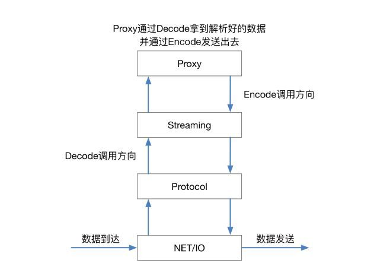
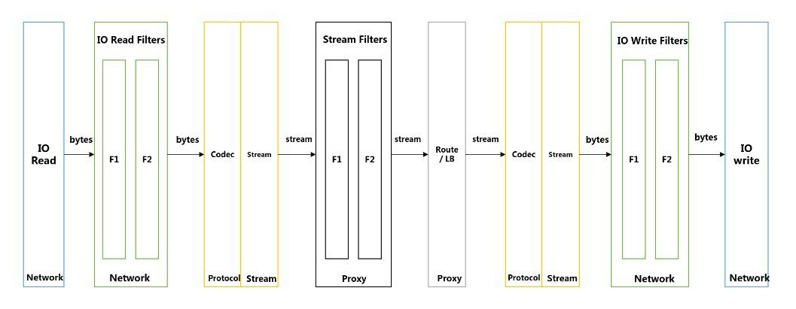

# 架构

MOSN 的组成由Net/IO、Protocol、Stream、Proxy 四层组成。

## MOSN 数据流转

将 SOFAMosn 作为代理处理的数据流划分为4层，在入方向数据依次经过网络 IO 层，二进制协议处理层，协议流程处理层，转发路由处理层；出向与入向过程基本相反。

## 各层职能

- IO 层提供了 IO 读写的封装以及可扩展的 IO 事件订阅机制
- PROTOCOL 层提供了根据不同协议对数据进行序列化/反序列化的处理能力
- STREAMING 层提供向上的协议一致性，负责 STREAM 生命周期，管理 Client / Server 模式的请求流行为，对 Client 端stream 提供池化机制等
- Proxy 层提供路由选择，负载均衡等的能力，让前后端 stream 流转起来。

大家可以从这张图清晰的看到单向请求流转的过程：

